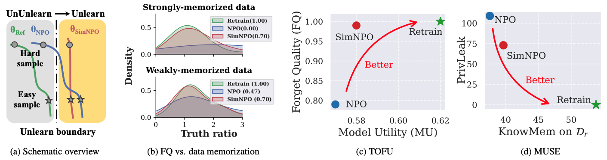

<div align='center'>
 
# Simplicity Prevails: Rethinking Negative Preference Optimization for LLM Unlearning

[](https://arxiv.org/abs/2410.07163)
[](https://huggingface.co/collections/OPTML-Group/simnpo-unlearned-models-6721751fb02ab0e490ab0017)
[](https://github.com/OPTML-Group/Unlearn-Simple/issues)

[](https://github.com/OPTML-Group/Unlearn-Simple?tab=MIT-1-ov-file)
[](https://github.com/OPTML-Group/Unlearn-Simple)
[](https://github.com/OPTML-Group/Unlearn-Simple)
[](https://github.com/OPTML-Group/Unlearn-Simple)

</div>

<table align="center">
  <tr>
    <td align="center"> 
       
      <br>
      <em style="font-size: 18px;">  <strong style="font-size: 18px;">Figure 1:</strong> Systematic overview and experiment highlights of SimNPO.</em>
    </td>
  </tr>
</table>

This is the official code repository for the paper [Simplicity Prevails: Rethinking Negative Preference Optimization for LLM Unlearning](https://arxiv.org/abs/2410.07163).

## News ## 
:mega: Check out our [latest work](https://github.com/OPTML-Group/Unlearn-Smooth) at ICML 2025 on making LLM unlearning more robust through smoothness optimization!

## Abstract

In this work, we address the problem of large language model (LLM) unlearning, aiming to remove unwanted data influences and associated model capabilities (*e.g.*, copyrighted data or harmful content generation) while preserving essential model utilities, without the need for retraining from scratch. Despite the growing need for LLM unlearning, a principled optimization framework remains lacking. To this end, we revisit the state-of-the-art approach, negative preference optimization (NPO), and identify the issue of reference model bias, which could undermine NPO's effectiveness, particularly when unlearning forget data of varying difficulty. Given that, we propose a simple yet effective unlearning optimization framework, called **SimNPO**, showing that 'simplicity' in removing the reliance on a reference model (through the lens of simple preference optimization) benefits unlearning. We also provide deeper insights into SimNPO's advantages, supported by analysis using mixtures of Markov chains. Furthermore, we present extensive experiments validating SimNPO's superiority over existing unlearning baselines in benchmarks like TOFU and MUSE, and robustness against relearning attacks.

## Getting Started
* [SimNPO on TOFU](TOFU)
* [SimNPO on MUSE](MUSE)
* [SimNPO on WMDP](WMDP)
* [SimNPO on Synthetic data](synthetic)

## Download Models
To directly using our unlearned model, please refer to our HuggingFace Collection:
* [🤗OPTML-Group/SimNPO-Unlearned-Models](https://huggingface.co/collections/OPTML-Group/simnpo-unlearned-models-6721751fb02ab0e490ab0017)

## Contributors
* [Chongyu Fan](https://a-f1.github.io/)
* [Jiancheng Liu](https://ljcc0930.github.io/)
* [Licong Lin](https://licong-lin.github.io/)

## Cite This Work
```
@article{fan2024simplicity,
  title={Simplicity Prevails: Rethinking Negative Preference Optimization for LLM Unlearning},
  author={Fan, Chongyu and Liu, Jiancheng and Lin, Licong and Jia, Jinghan and Zhang, Ruiqi and Mei, Song and Liu, Sijia},
  journal={arXiv preprint arXiv:2410.07163},
  year={2024}
}
```
